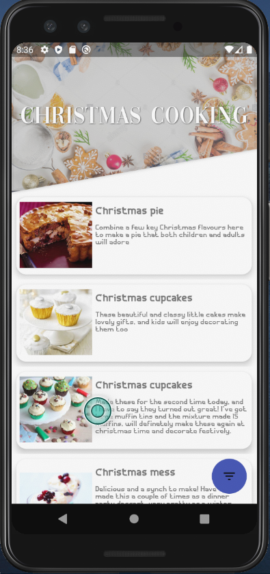
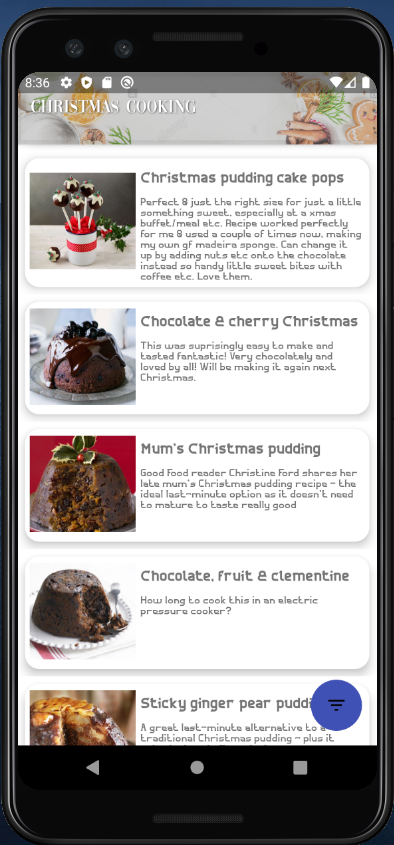
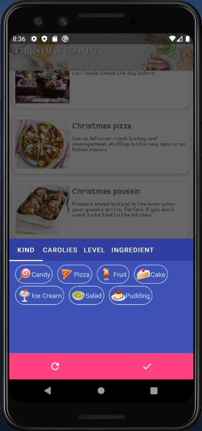
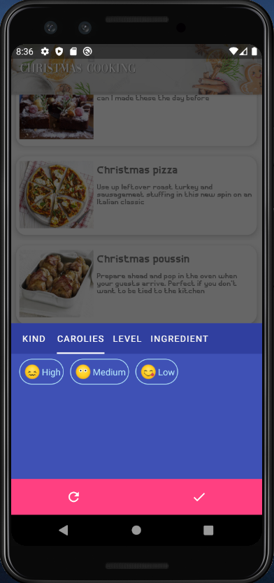
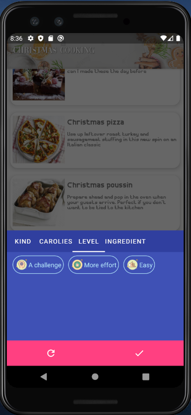
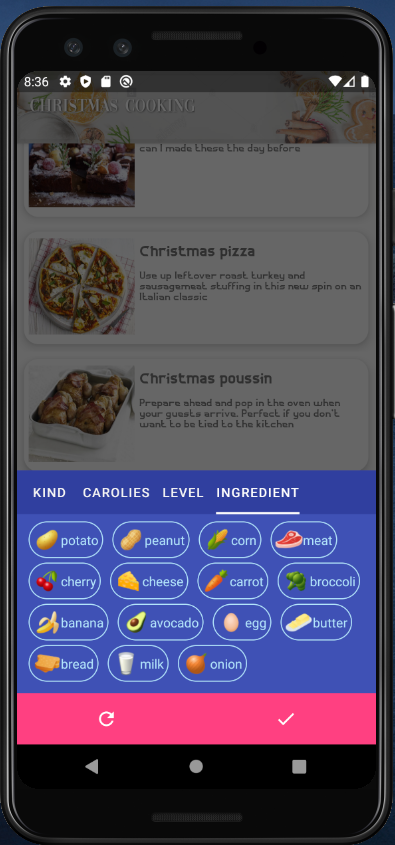
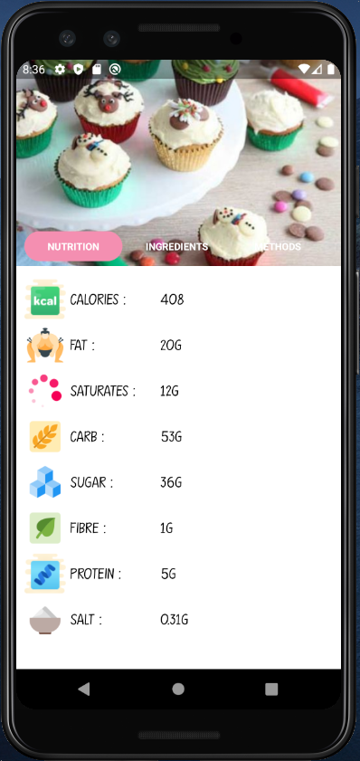
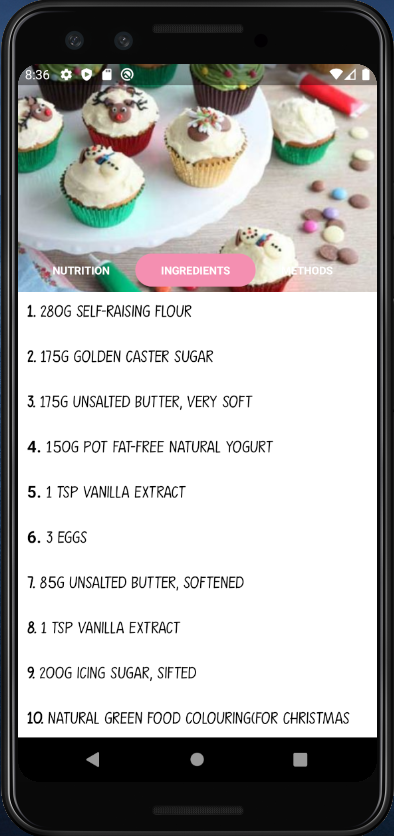
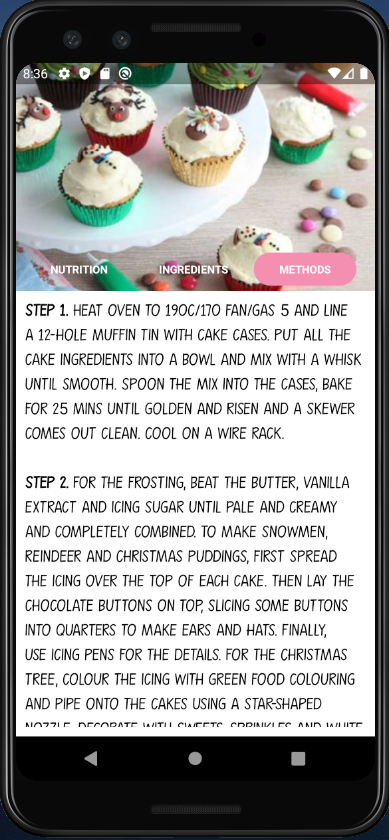

# ChristmasRecipes Application
## Purpose : 
I created this application for practicing Android Recycleview, Fragment and DatabaseHandling

## Ideal : 
You can search some recipes for Christmas party. And if you like any recpie, you can explore some information about recpies (nutrtion fact, ingredients and cooking steps)
I created <a href="https://github.com/nguyenduylong/ChristmasRecipeDataManipulating"> Data manipulating project</a> for crawling data from <a href="https://www.bbcgoodfood.com/">BBC GoodFood</a> and saved into sqlite database for this application
## Using Libraries:
Some libraries which I used in this application:

1. <a href="https://developer.android.com/training/constraint-layout/motionlayout">Motion Layout</a> : A layout type that helps you manage motion and widget animation in your app.
2. <a href="https://github.com/bumptech/glide">Glide</a> : A fast and efficient open source media management and image loading framework for Android that wraps media decoding, memory and disk caching, and resource pooling into a simple and easy to use interface
3. <a href="https://github.com/ogaclejapan/SmartTabLayout">SmartTabLayout</a> : A custom ViewPager title strip which gives continuous feedback to the user when scrolling.
4. <a href="https://github.com/Krupen/FabulousFilter">Filter Fab</a> : It makes animation of FloatingActionButton to BottomSheetDialog easy to implement.

## Functionalities:
Some functionalities that I developed in this app:

1. Display all recipes for Christmas
2. Filter list by kind of recipe, skill level, carolies , ingredient. 
3. View nutrtion facts, ingredients and methods of recipe.

## Demo:
Some images that I captured:

Main Activity            |   Recipe List
:-------------------------:|:-------------------------:
  |  

Kind Filter           |   Calories Filter              | Skill level filter     | Ingredient Filter
:-------------------------:|:-------------------------:|:-------------------------:|:-------------------------:|
  |    |     |  

Recipe Nutrition Fact      |   Recipe Ingredient        | Recipe Cooking Steps
:-------------------------:|:-------------------------:|:-------------------------
 |     | 

## Video demo: 
<a href="https://www.youtube.com/watch?v=3JiPJ-arbRo">Demo</a>